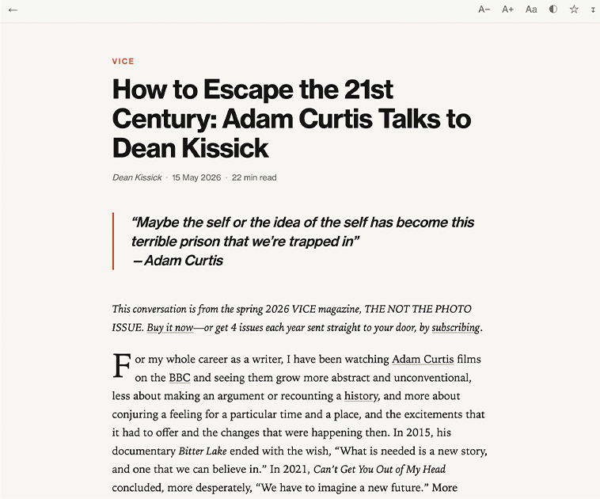
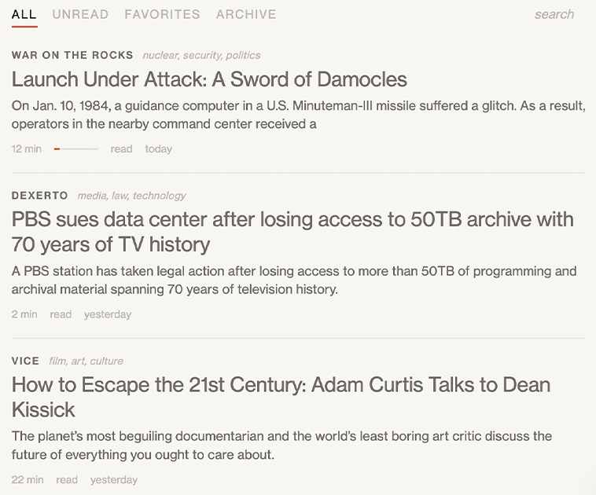

# particle

### A self-hosted tool to read & save articles without all the interruptions

### inspired by the same vitriol behind <a href='https://lxe.github.io/everywebsite/'> this gem. </a>

 #### Paste a URL → particle pulls the article out of the page (text, images, pullquotes, structure) → files it in a searchable library you own for clean reading without autoplay videos, subscription CTAs, ads or cookie notifications.

 ---


  


### [**Try the demo**](https://particle.crnst8.com/try)

 **Note**: the demo library lives in your browser. Saving, favourites and reading
 progress use localStorage; nothing is stored on the server. The self-hosted
 version saves pasted links into SQLite for later recall.

---


## Quick start

**Docker** (recommended):

```sh
docker run -d --name particle -p 4747:4747 -v particle-data:/app/data \
  ghcr.io/crnst8/particle:latest
```

Open <http://localhost:4747>.

**Docker Compose** — save this as `docker-compose.yml`:

```yaml
services:
  particle:
    image: ghcr.io/crnst8/particle:latest
    ports: ["4747:4747"]
    volumes: [particle-data:/app/data]
    restart: unless-stopped
volumes:
  particle-data:
```

```sh
docker compose up -d
```

**Without Docker**: needs Node 24 or newer (particle uses the built-in
`node:sqlite`, so there is nothing to compile):

```sh
git clone https://github.com/crnst8/particle && cd particle
npm ci
npm start
```


---

## Features
### Article Extraction
- Extracts article content using Mozilla Readability.
- Sanitises extracted content with DOMPurify.
- Uses multiple fallback methods when standard extraction fails:
  - Direct page fetch
  - Googlebot user-agent
  - AMP version
  - Wayback Machine
- Keeps the longest available version if all sources are truncated.
- Flags incomplete articles as **partial**.
- Supports one-click re-extraction.

### Reading Experience
- Serif and sans-serif font options.
- Adjustable text size.
- Light, sepia and dark themes.
- Optional drop caps.
- Preserves pullquotes.
- Displays estimated reading time.
- Reading progress bar.
- Saves reading position and syncs it across devices.

### Search & Organisation
- Full-text search across all saved articles.
- SQLite FTS5 search with Porter stemming.
- Favourite articles.
- Archive articles.

### Image Handling
- Proxies article images so hotlink-protected images continue to load.
- Strips the referer when requesting images.

### Offline & Installation
- Progressive Web App (PWA).
- Can be installed to the home screen.
- Saved articles can be read offline.

### Optional AI Tagging
- Supports any OpenAI-compatible endpoint.
- Automatically assigns 1–3 topic tags to saved articles.
- Generates a completeness verdict for each article.
- Sends the title and excerpts of article text to the endpoint you configure.
- Stores only the returned tags and completeness verdict.
- Never rewrites article text.
- Disabled by default until configured.


### Shortcuts:

 `j`/`k` scroll 

 `f` favourite 
 
 `e` archive 
 
  `/` search 


`esc` back.

---

## Configuration

**Everything is optional** - set variables in the environment, or in a `.env` file
next to the compose file — see [`.env.example`](.env.example).

| Variable | Default | What it does |
|---|---|---|
| `PORT` | `4747` | HTTP port |
| `PARTICLE_DB` | `./data/particle.db` | Path to the SQLite file |
| `PARTICLE_PASSWORD` | unset | Optional single-user password. Set it if the app is reachable from the internet |
| `PARTICLE_SESSION_SECRET` | generated | Cookie signing key; generated in the data directory when authentication is enabled |
| `PARTICLE_TRUST_PROXY` | `0` | Set to `1` behind an HTTPS reverse proxy |
| `PARTICLE_BASE` | unset | Mount below a path such as `/particle` |
| `ALLOW_PRIVATE_HOSTS` | `0` | Set to `1` only when you intentionally save pages from a private network |
| `IMAGE_MAX_BYTES` | `8388608` | Maximum image-proxy response size |
| `LLM_API_KEY` | unset | API key for the optional tagging/quality pass. Unset = feature off |
| `LLM_API_URL` | OpenCode Zen | Any OpenAI-compatible `/chat/completions` URL — Ollama, OpenRouter, whatever you run |
| `LLM_MODEL` | `deepseek-v4-flash` | Model name for the above |

The older `OPENCODE_KEY`, `OPENCODE_API` and `OPENCODE_MODEL` names remain
accepted as aliases.

Authentication is off by default for a frictionless localhost install. If the
port is reachable from the public internet, set `PARTICLE_PASSWORD`; for example:

```sh
docker run -d --name particle -p 4747:4747 -v particle-data:/app/data \
  -e PARTICLE_PASSWORD='use-a-long-password' \
  ghcr.io/crnst8/particle:latest
```

## Data storage 

Everything lives in one SQLite file. Back it up by copying it:

```sh
docker cp particle:/app/data/particle.db ./particle-backup.db
```


## PWA & Bookmarklet 

Open particle and drag the generated **save to particle** link at the bottom of
the library into your bookmarks. It is built from the current origin and base
path, so there is nothing to edit by hand.

On iOS, install the PWA (Share → Add to Home Screen) and it registers as a share
target — send any article to particle straight from Safari.

## Development

```sh
npm ci
npm run dev          # node --watch, http://localhost:4747
./dev.sh start       # or run it in Docker: start | stop | restart | status | logs
```


## License

MIT © Current State Projects 2026
