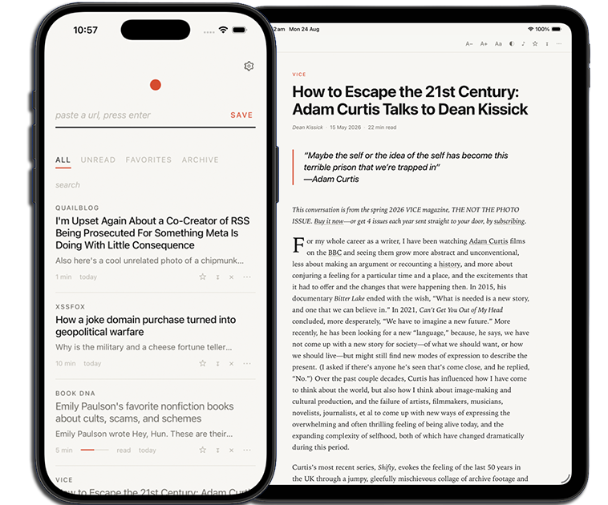

<div align="center">


# particle

### A self-hosted tool to read & save articles without all the interruptions


 

<br />

  ## [Try the demo](https://particle.crnst8.com/try)

 #### Paste a URL → particle pulls the article out of the page (text, images, pullquotes, structure) → files it in a searchable library you own for clean reading without autoplay videos, subscription CTAs, ads or cookie notifications.


</div>


## Quick start

**Docker** (recommended):

```sh
docker run -d --name particle -p 4747:4747 -v particle-data:/app/data \
  ghcr.io/crnst8/particle:latest
```

Open <http://localhost:4747>.

**Docker Compose** — save this as `docker-compose.yml`:

```yaml
services:
  particle:
    image: ghcr.io/crnst8/particle:latest
    ports: ["4747:4747"]
    volumes: [particle-data:/app/data]
    restart: unless-stopped
volumes:
  particle-data:
```

```sh
docker compose up -d
```

**Without Docker**: needs Node 24 or newer (particle uses the built-in
`node:sqlite`, so there is nothing to compile):

```sh
git clone https://github.com/crnst8/particle && cd particle
npm ci
npm start
```


---

## Features
### Article Extraction
- Extracts article content using Mozilla Readability.
- Sanitises extracted content with DOMPurify.
- Uses multiple fallback methods when standard extraction fails:
  - Direct page fetch
  - Googlebot user-agent
  - AMP version
  - Wayback Machine
  - archive.today (archive.is / .ph / .md and the other mirrors)
- Keeps the longest available version if all sources are truncated.
- Flags incomplete articles as **partial**.
- Supports one-click re-extraction.
- Reads PDFs too — see below.

### PDFs
Paste a PDF link like any other article. A PDF is detected by its bytes rather
than its URL, so a link served as `application/octet-stream` still works, and
the same fallbacks (direct, Googlebot, Wayback) apply.

A PDF carries no structure — only glyphs at coordinates — so particle rebuilds
it: columns are read one at a time, wrapped lines rejoin into paragraphs, words
broken across a line put themselves back together, headings are recovered from
type size and placement, and running heads and page numbers are dropped instead
of interrupting a sentence. The title comes from the PDF's metadata only when
the document actually prints it; otherwise it is taken from the largest type on
page one. The result is sanitised and stored exactly like a scraped page.

Images inside a PDF are not extracted. `PDF_MAX_BYTES` and `PDF_MAX_PAGES`
bound the work; see `.env.example`.

### Scanned PDFs (OCR)
A page carrying no text layer is a picture of a page, and is read with
Tesseract. The words come back with their positions, so a scan goes through the
same column, paragraph and heading reconstruction as any other PDF.

The page is rendered at **the scan's own resolution, not the page's**. This is
the difference between working and not: a long screenshot printed to PDF is
squeezed into whatever box the printer chose — a 708×12030 pixel capture can
land in a 46-point-wide sliver of a letter page — and rendering that at page
scale reads a column of text as a 46-pixel smear. Particle measures the pixels
the image actually has and renders to match.

Tall pages are sliced before reading, and the cuts fall only in blank bands, so
no line is ever read in halves. Slices are read in parallel.

The language model (~15MB) is downloaded on first use and cached beside the
database; set `OCR_LANG_PATH` to a local directory for an air-gapped install.
`OCR_MAX_PAGES` caps how many scanned pages one document may cost — past it the
article is saved and marked partial rather than holding the queue. Set
`OCR_ENABLED=0` to switch it off, and a scan then fails instead of being read.

### archive.today snapshots
- Paste an `archive.is/…` link and particle reads that capture, filing it under
  the original article's URL so it dedupes against the story itself.
- Otherwise the mirrors are consulted automatically when every other route is
  paywalled, using the memento timemap to find the newest capture.
- The archive.today wrapper is stripped and images are pointed back at their
  original hosts before the page reaches Readability.

### When a snapshot cannot be fetched
The mirrors rate-limit by IP, gate on a captcha cookie, and do not send CORS
headers on a served snapshot. Every mirror is tried, but they share one backend,
so a blocked address stays blocked. Particle then tries the fetch from your
browser, and if that fails too, opens a panel:

1. **open snapshot** in a new tab, wait for the article, solve a captcha if one
   appears.
2. **send page to particle**, a bookmarklet the panel generates. Drag it to the
   bookmarks bar once, then one click per rescue.
3. Or paste into the panel: page source (view source, select all, copy), or the
   plain article text.

The page source has to come out of that tab because the captcha is cleared
against a cookie only that tab holds; a cross-origin fetch is uncredentialed and
gets the captcha again. The bookmarklet posts back on a single-use ticket that
expires in 15 minutes.

The source is parsed server-side and saved like any other article. A capture
reached by short code (`archive.is/kSJh2`) is filed under the story's own URL,
and an article already saved as *partial* is rewritten in place.

> The bookmarklet is desktop only, and browsers block it from an HTTPS page to a
> plain-HTTP particle (Chrome and Firefox exempt `localhost`; Safari does not).
> Paste is the fallback, and on mobile it is the only route.

### Reading Experience
- Serif and sans-serif font options.
- Adjustable text size.
- Light, sepia and dark themes, or follow the device.
- A choice of accent colour.
- Optional drop caps.
- Preserves pullquotes.
- Displays estimated reading time.
- Reading progress bar.
- Saves reading position and syncs it across devices.

### Search & Organisation
- Full-text search across all saved articles.
- SQLite FTS5 search with Porter stemming.
- Favourite articles.
- Archive articles.
- Delete articles, from the library row or from the reader.
- Lists you make yourself. Each one becomes a tab in the library; an article can
  be in any number of them, added from its `⋯` menu.
- Read articles either stay in the main tab or move to a **read** tab of their own.

### Settings
Reached from the gear on the library screen.
- **Appearance** — theme (device / light / sepia / dark) and accent colour.
- **Reading** — typeface and default text size, with a live sample.
- **Library** — where read articles show up.
- **Lists** — create, rename and delete lists. Deleting a list leaves its articles alone.
- **Reset** — delete every saved article, and optionally every list. Typed
  confirmation, no undo, no export.

### Trimming a saved article
An article you saved is yours to edit. **⋯ → trim sections…** in the reader turns
on trim mode:
- Click or tap a paragraph, heading, pullquote, figure or list to mark it.
- Or select a run of text and press **mark selection** (or backspace) to mark
  exactly that.
- Marked passages are struck through and tinted; nothing is written until
  **remove & save**, which asks first.
- **Cancel** restores the article exactly. Re-extracting is the way back to the
  original after a save.
- Trimmed articles are marked as such in the library, and their reading time,
  excerpt and search text follow the edit.

### Image Handling
- Proxies article images so hotlink-protected images continue to load.
- Strips the referer when requesting images.

### Offline & Installation
- Progressive Web App (PWA).
- Can be installed to the home screen.
- Saved articles can be read offline.

### Optional Narration (read aloud)
- Adds a **listen** button to the reader, with a player that follows along.
- Writes a spoken script from the article rather than reading the raw text:
  - Headings, quotes and list items each get their own pacing and pause, and the
    pause is silence inside the audio, so it survives a locked phone.
  - Image captions are left out by default; the player can turn them back on.
  - Pullquotes that only repeat the body are dropped, so nothing is read twice.
  - Code blocks and tables are skipped instead of spelled out.
  - Footnote markers vanish; links are read as their domain, not character by character.
  - `12%`, `$1.2bn`, `e.g.`, `2019–2024` and em dashes are said the way a person would.
- Casts a voice per article from the provider's catalogue — subject, length and
  the article's own tags decide the register. With an LLM key configured it also
  writes the spoken opening line and a pronunciation list for the names, acronyms
  and product names in *that* article.
- Speaks an opening line: publication, title, author, running time.
- Playback: scrub bar, 15-second skips, speeds from 0.85× to 2×, and a resume
  point synced with the rest of the library.
- Keeps playing with the screen locked, including as a home-screen app: lock-screen
  and headphone controls, a lock-screen scrub bar over the whole article, and
  nothing between passages that a suspended phone could fail to run.
- Tap any paragraph to start reading from there; the paragraph being spoken is
  highlighted and scrolls into view.
- Synthesis follows playback, so an article you abandon after a paragraph costs a
  paragraph. Audio is cached in the same SQLite file and replays for free.
- Voices can be swapped, or the whole narration recast, from the player.
- Disabled by default until configured.

### Optional AI Tagging
- Supports any OpenAI-compatible endpoint.
- Automatically assigns 1–3 topic tags to saved articles.
- Generates a completeness verdict for each article.
- Sends the title and excerpts of article text to the endpoint you configure.
- Stores only the returned tags and completeness verdict.
- Never rewrites article text.
- Disabled by default until configured.


### Shortcuts:

 `j`/`k` scroll 

 `f` favourite 
 
 `e` archive 
 
 `l` listen 
 
  `/` search 


`esc` back — and closes settings, a menu, or trim mode.

In trim mode, `backspace` marks the current selection.

---

## Configuration

**Everything is optional** - set variables in the environment, or in a `.env` file
next to the compose file — see [`.env.example`](.env.example).

| Variable | Default | What it does |
|---|---|---|
| `PORT` | `4747` | HTTP port |
| `PARTICLE_DB` | `./data/particle.db` | Path to the SQLite file |
| `PARTICLE_PASSWORD` | unset | Optional single-user password. Set it if the app is reachable from the internet |
| `PARTICLE_SESSION_SECRET` | generated | Cookie signing key; generated in the data directory when authentication is enabled |
| `PARTICLE_TRUST_PROXY` | `0` | Set to `1` behind an HTTPS reverse proxy |
| `PARTICLE_BASE` | unset | Mount below a path such as `/particle` |
| `ALLOW_PRIVATE_HOSTS` | `0` | Set to `1` only when you intentionally save pages from a private network |
| `IMAGE_MAX_BYTES` | `8388608` | Maximum image-proxy response size |
| `SNAPSHOT_MAX_BYTES` | `8388608` | Maximum page source accepted from the browser during an archive.today rescue |
| `ARCHIVE_TODAY_HOSTS` | mirror list | Comma-separated archive.today mirrors to try, in order |
| `ARCHIVE_TODAY_COOKIE` | unset | Cookie header sent to archive.today, if you have a session that clears the captcha server-side |
| `LLM_API_KEY` | unset | API key for the optional tagging/quality pass. Unset = feature off |
| `LLM_API_URL` | OpenCode Zen | Any OpenAI-compatible `/chat/completions` URL — Ollama, OpenRouter, whatever you run |
| `LLM_MODEL` | `deepseek-v4-flash` | Model name for the above |
| `TTS_API_KEY` | unset | API key for narration. Unset = feature off. A free [Fish Audio](https://fish.audio) key works |
| `TTS_API_URL` | Fish Audio | Text-to-speech endpoint |
| `TTS_MODEL` | `s2.1-pro-free` | Voice model sent in the `model` header |
| `TTS_VOICE_ID` | unset | Pin one voice instead of casting per article |
| `TTS_VOICE_LOCK` | `0` | Set to `1` to use `TTS_VOICE_ID` for everything |
| `TTS_BITRATE` | `64` | mp3 bitrate: 64, 128 or 192 kbps |
| `TTS_SEGMENT_CHARS` | `1100` | Largest chunk of text sent in one request |
| `TTS_CONCURRENCY` | `2` | Synthesis requests in flight at once |
| `TTS_WARM_AHEAD` | `3` | Segments synthesised ahead of playback |
| `TTS_MAX_CACHE_MB` | `512` | Ceiling for cached narration audio |

The older `OPENCODE_KEY`, `OPENCODE_API` and `OPENCODE_MODEL` names remain
accepted as aliases, as do `FISH_AUDIO_API` and `FISH_API_KEY` for `TTS_API_KEY`.

Narration and tagging are independent. Narration works on its own; adding an
`LLM_API_KEY` on top is what lets it read the article before casting it — the
voice, the pace, the spoken opening line and the per-article pronunciation list
all come from that pass. Without it, particle falls back to the article's tags
and the voice catalogue's own labels.

Authentication is off by default for a frictionless localhost install. If the
port is reachable from the public internet, set `PARTICLE_PASSWORD`; for example:

```sh
docker run -d --name particle -p 4747:4747 -v particle-data:/app/data \
  -e PARTICLE_PASSWORD='use-a-long-password' \
  ghcr.io/crnst8/particle:latest
```

## Data storage 

Everything lives in one SQLite file — narration audio included. Back it up by
copying it:

```sh
docker cp particle:/app/data/particle.db ./particle-backup.db
```


## PWA & Bookmarklet 

Open particle and drag the generated **save to particle** link at the bottom of
the library into your bookmarks. It is built from the current origin and base
path, so there is nothing to edit by hand.

On iOS, install the PWA (Share → Add to Home Screen) and it registers as a share
target — send any article to particle straight from Safari.

## Development

```sh
npm ci
npm run dev          # node --watch, http://localhost:4747
./dev.sh start       # or run it in Docker: start | stop | restart | status | logs
```


## License

MIT © Current State Projects 2026
