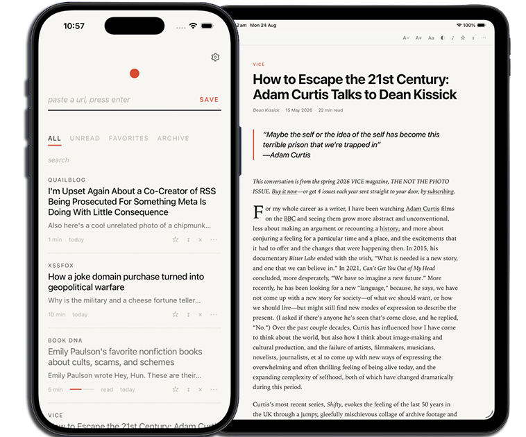

<div align="center">


# particle

### A self-hosted tool to read & save articles without all the interruptions


 

<br />

  ## [Try the demo](https://particle.crnst8.com/try)

 #### Paste a URL → particle pulls the article out of the page (text, images, pullquotes, structure) → files it in a searchable library you own for clean reading without autoplay videos, subscription CTAs, ads or cookie notifications.


</div>


## Quick start

**Docker** (recommended):

```sh
docker run -d --name particle -p 4747:4747 -v particle-data:/app/data \
  ghcr.io/crnst8/particle:latest
```

Open <http://localhost:4747>.

**Docker Compose** — save this as `docker-compose.yml`:

```yaml
services:
  particle:
    image: ghcr.io/crnst8/particle:latest
    ports: ["4747:4747"]
    volumes: [particle-data:/app/data]
    restart: unless-stopped
volumes:
  particle-data:
```

```sh
docker compose up -d
```

**Without Docker**: needs Node 24 or newer (particle uses the built-in
`node:sqlite`, so there is nothing to compile):

```sh
git clone https://github.com/crnst8/particle && cd particle
npm ci
npm start
```


---

## Features
### Article Extraction
- Extracts article content using Mozilla Readability.
- Sanitises extracted content with DOMPurify.
- Uses multiple fallback methods when standard extraction fails:
  - Direct page fetch
  - Googlebot user-agent
  - AMP version
  - Wayback Machine
  - archive.today (archive.is / .ph / .md and the other mirrors)
- Keeps the longest available version if all sources are truncated.
- Flags incomplete articles as **partial**.
- Supports one-click re-extraction.
- Reads PDFs too — see below.

### PDFs
Paste a PDF link like any other article. A PDF is detected by its bytes rather
than its URL, so a link served as `application/octet-stream` still works, and
the same fallbacks (direct, Googlebot, Wayback) apply.

A PDF carries no structure — only glyphs at coordinates — so particle rebuilds
it: columns are read one at a time, wrapped lines rejoin into paragraphs, words
broken across a line put themselves back together, headings are recovered from
type size and placement, and running heads and page numbers are dropped instead
of interrupting a sentence. The title comes from the PDF's metadata only when
the document actually prints it; otherwise it is taken from the largest type on
page one. The result is sanitised and stored exactly like a scraped page.

Images inside a PDF are not extracted. `PDF_MAX_BYTES` and `PDF_MAX_PAGES`
bound the work; see `.env.example`.

### Scanned PDFs (OCR)
A page carrying no text layer is a picture of a page, and is read with
Tesseract. The words come back with their positions, so a scan goes through the
same column, paragraph and heading reconstruction as any other PDF.

The page is rendered at **the scan's own resolution, not the page's**. This is
the difference between working and not: a long screenshot printed to PDF is
squeezed into whatever box the printer chose — a 708×12030 pixel capture can
land in a 46-point-wide sliver of a letter page — and rendering that at page
scale reads a column of text as a 46-pixel smear. Particle measures the pixels
the image actually has and renders to match.

Tall pages are sliced before reading, and the cuts fall only in blank bands, so
no line is ever read in halves. Slices are read in parallel.

The language model (~15MB) is downloaded on first use and cached beside the
database; set `OCR_LANG_PATH` to a local directory for an air-gapped install.
`OCR_MAX_PAGES` caps how many scanned pages one document may cost — past it the
article is saved and marked partial rather than holding the queue. Set
`OCR_ENABLED=0` to switch it off, and a scan then fails instead of being read.

### Saving from a screenshot
The reader is in TikTok, a video mentions an article, and a screenshot is the
only thing that comes with them. Hand particle the picture — the 🖼 button, a
paste, a drag, or the system share sheet on Android — and it works out what the
picture refers to and saves the article itself.

Reading the picture is one call to a vision model (`SCREENSHOT_MODEL`, over the
same OpenAI-compatible endpoint as tagging). It is asked to separate the article
from the app around it — the status bar, "Find related content", like counts,
the comment box — and to report what it can read: title, deck, masthead, byline,
date, and any domain legible on screen. It is asked **not** to guess a URL,
because a guessed URL looks exactly like a real one and 404s.

Finding the link costs nothing. The publishing platforms answer questions about
their own archives for free, so particle asks them in order:

1. a URL or bare domain legible in the picture
2. that publication's archive — Substack's `?search=`, or WordPress search
3. the masthead spelled as an address (*Elevated It Girl* → `elevateditgirl`)
4. **who the author is**, which is the route that survives a newsletter whose
   name and address share no letters — *mindbox* publishes at
   `contemplationstation.substack.com`, and the TikTok handle is frequently the
   Substack handle
5. Crossref, when the picture is a paper's title page

Nothing is accepted on a name alone. `theculturist.substack.com` is a real
publication of exactly that name holding none of these articles, and
`mymusings.substack.com` was abandoned in 2020 — so a candidate is only saved
when its **title, date and byline agree** with what the picture said. Guessing
wrong is worse than not finding it.

**When it just saves, and when it asks.** A find is *certain* when the title
matched outright **and** something else the picture said matched too — the date,
the byline, or a domain that was legible on screen rather than guessed from a
name. One agreement is a coincidence a common title can manage; two independent
ones is the article. A certain find is filed without asking, and anything else
the picture named is offered underneath the confirmation rather than standing in
the way of it. Only when nothing is certain does the picker ask first.

**It answers in stages.** Reading a picture and then asking several archives
about it is the slowest thing particle does, so the route streams a line per
stage — uploaded, reading, read, each lookup as it lands. For as long as it
runs, the URL field steps aside and the progress takes its place: which stage,
how long it has been, and a cancel. There is nothing to type into that field
while it waits, and a status that has not moved for forty seconds reads as a
hang whether or not it is one.

**Speed.** The picture is re-encoded before it is sent: a phone screenshot is a
lossless PNG of a photograph, which is the worst case for PNG, and JPEG at the
same resolution is five to eight times smaller (2.8MB → 417KB for one of these).
Nothing is resampled at phone sizes — the small grey type carrying a domain is
exactly what a resize destroys — only pictures genuinely larger than a phone's
come down to fit. Lookups run in parallel, and only the surest few candidates
are looked up at all.

**If the link is found but the page will not open** — a hard paywall, a DOI
landing page — the article is saved as a *link*: its real title, byline and
publication from the picture, marked `link` in the list, with the same "try
again / try archive.today" recovery a partial extraction gets.

Without `LLM_API_KEY` this falls back to OCR, which reads the headline and
little else: the small grey type carrying the domain is exactly what Tesseract
loses. The screenshot itself is never stored — it is read, discarded, and the
article saved from its own URL.

**What leaves your machine.** With a key set, the whole picture is sent to
whatever `LLM_API_URL` points at. A phone screenshot is not only the article: it
carries the status bar, the time, any notification on screen, and whatever else
was open behind it. Point it at a provider you would send that to, or leave the
key unset and stay on local OCR. Nothing is written to disk at any point, the
library stores the article and not the picture, and the resolvers afterwards
send only a title — never the image — to the archives they ask.

### archive.today snapshots
- Paste an `archive.is/…` link and particle reads that capture, filing it under
  the original article's URL so it dedupes against the story itself.
- Otherwise the mirrors are consulted automatically when every other route is
  paywalled, using the memento timemap to find the newest capture.
- The archive.today wrapper is stripped and images are pointed back at their
  original hosts before the page reaches Readability.

### When a snapshot cannot be fetched
The mirrors rate-limit by IP, gate on a captcha cookie, and do not send CORS
headers on a served snapshot. Every mirror is tried, but they share one backend,
so a blocked address stays blocked. Particle then tries the fetch from your
browser, and if that fails too, opens a panel:

1. **open snapshot** in a new tab, wait for the article, solve a captcha if one
   appears.
2. **send page to particle**, a bookmarklet the panel generates. Drag it to the
   bookmarks bar once, then one click per rescue.
3. Or paste into the panel: page source (view source, select all, copy), or the
   plain article text.

The page source has to come out of that tab because the captcha is cleared
against a cookie only that tab holds; a cross-origin fetch is uncredentialed and
gets the captcha again. The bookmarklet posts back on a single-use ticket that
expires in 15 minutes.

The source is parsed server-side and saved like any other article. A capture
reached by short code (`archive.is/kSJh2`) is filed under the story's own URL,
and an article already saved as *partial* is rewritten in place.

> The bookmarklet is desktop only, and browsers block it from an HTTPS page to a
> plain-HTTP particle (Chrome and Firefox exempt `localhost`; Safari does not).
> Paste is the fallback, and on mobile it is the only route.

### Reading Experience
- Serif and sans-serif font options.
- Adjustable text size.
- Light, sepia and dark themes, or follow the device.
- A choice of accent colour.
- Optional drop caps.
- Preserves pullquotes.
- Displays estimated reading time.
- Reading progress bar.
- Saves reading position and syncs it across devices.

### Search & Organisation
- Full-text search across all saved articles.
- SQLite FTS5 search with Porter stemming.
- Favourite articles.
- Archive articles.
- Delete articles, from the library row or from the reader.
- Lists you make yourself. Each one becomes a tab in the library; an article can
  be in any number of them, added from its `⋯` menu.
- Read articles either stay in the main tab or move to a **read** tab of their own.

### Settings
Reached from the gear on the library screen.
- **Appearance** — theme (device / light / sepia / dark) and accent colour.
- **Reading** — typeface and default text size, with a live sample.
- **Library** — where read articles show up.
- **Lists** — create, rename and delete lists. Deleting a list leaves its articles alone.
- **Reset** — delete every saved article, and optionally every list. Typed
  confirmation, no undo, no export.

### Trimming a saved article
An article you saved is yours to edit. **⋯ → trim sections…** in the reader turns
on trim mode:
- Click or tap a paragraph, heading, pullquote, figure or list to mark it.
- Or select a run of text and press **mark selection** (or backspace) to mark
  exactly that.
- Marked passages are struck through and tinted; nothing is written until
  **remove & save**, which asks first.
- **Cancel** restores the article exactly. Re-extracting is the way back to the
  original after a save.
- Trimmed articles are marked as such in the library, and their reading time,
  excerpt and search text follow the edit.

### Image Handling
- Proxies article images so hotlink-protected images continue to load.
- Strips the referer when requesting images.

### Offline & Installation
- Progressive Web App (PWA).
- Can be installed to the home screen.
- Saved articles can be read offline.

### Optional Narration (read aloud)
- Adds **listen** to the reader. The button says what it will do: *listen* on a
  new article, *resume* where you stopped, *listen again* once you have finished.
  *Start over* is beside it.
- Reads the article, not the page around it:
  - Captions, image credits, bylines, datelines, reading times, share and
    subscribe lines, tables, code, footnote markers and pullquotes that repeat
    the body are never spoken. There is no opening or closing announcement;
    title, author and site stay on the screen and the lock screen.
  - Excluded text stays on the page, a shade quieter while you listen.
  - Unlabelled captions cannot all be recognised. Select any paragraph and
    choose *skip when reading aloud* (or *read this aloud* to undo a guess).
    The mark is saved with the article.
  - `12%`, `$1.2bn`, `e.g.`, `2019–2024` and em dashes are said the way a person would.
- Start anywhere: select text and choose *listen from here*, press `l` with text
  selected, or *listen from visible paragraph* in the article menu (`L`).
- One voice, chosen by you: a **default voice** for the library in settings
  (searchable, with samples, shared by every device), or *Automatic*, which picks
  once per article and keeps it. Any article can have its own voice from the
  player; *use default* puts it back. The player says where the voice came from.
- Switching voice stops the old one at once and starts the new one at the same
  passage, paused or playing as you were.
- The bookmark is a passage, not a number of seconds: resuming in the same voice
  continues to the second, another voice restarts the current short passage, and
  an edited article resumes at the same paragraph if it is still there. It is
  saved on this device every couple of seconds and on the server every few, and
  if two devices disagree you choose which place to keep.
- When something goes wrong the passage stays where it is with *retry*, *choose
  voice* and *skip passage*. Nothing is skipped on its own, and a player that
  cannot play says so instead of showing a pause button over silence.
- Synthesis follows playback, a little ahead of it, and stops for passages you
  are no longer heading towards. Audio is cached in the same SQLite file under a
  byte ceiling; a voice you return to plays from the cache.
- *Download for offline listening* (player panel, or the article menu) keeps an
  article's audio in this browser. A downloaded article plays with no
  connection. Browsers may still clear stored data when they need room.
- Keeps playing with the screen locked as far as the browser allows, with
  lock-screen and headphone controls. See [narration on phones](#narration-on-phones).
- Disabled by default until configured.

### Optional AI Tagging
- Supports any OpenAI-compatible endpoint.
- Automatically assigns 1–3 topic tags to saved articles.
- Generates a completeness verdict for each article.
- Sends the title and excerpts of article text to the endpoint you configure.
- Stores only the returned tags and completeness verdict.
- Never rewrites article text.
- Disabled by default until configured.
- Settings shows whether it is on and how many articles have no tags, with a
  button that tags them — for a library that predates the key, or outlived a
  provider outage.


### Shortcuts:

 `j`/`k` scroll 

 `f` favourite 
 
 `e` archive 
 
 `l` listen / pause — or listen from the selected paragraph 

 `L` listen from the first paragraph on screen 
 
  `/` search 


`esc` back — and closes settings, a menu, or trim mode.

In trim mode, `backspace` marks the current selection.

---

## Configuration

**Everything is optional** - set variables in the environment, or in a `.env` file
next to the compose file — see [`.env.example`](.env.example).

| Variable | Default | What it does |
|---|---|---|
| `PORT` | `4747` | HTTP port |
| `PARTICLE_DB` | `./data/particle.db` | Path to the SQLite file |
| `PARTICLE_PASSWORD` | unset | Optional single-user password. Set it if the app is reachable from the internet |
| `PARTICLE_SESSION_SECRET` | generated | Cookie signing key; generated in the data directory when authentication is enabled |
| `PARTICLE_TRUST_PROXY` | `0` | Set to `1` behind an HTTPS reverse proxy |
| `PARTICLE_BASE` | unset | Mount below a path such as `/particle` |
| `ALLOW_PRIVATE_HOSTS` | `0` | Set to `1` only when you intentionally save pages from a private network |
| `IMAGE_MAX_BYTES` | `8388608` | Maximum image-proxy response size |
| `SNAPSHOT_MAX_BYTES` | `8388608` | Maximum page source accepted from the browser during an archive.today rescue |
| `ARCHIVE_TODAY_HOSTS` | mirror list | Comma-separated archive.today mirrors to try, in order |
| `ARCHIVE_TODAY_COOKIE` | unset | Cookie header sent to archive.today, if you have a session that clears the captcha server-side |
| `LLM_API_KEY` | unset | API key for the optional tagging/quality pass. Unset = feature off |
| `LLM_API_URL` | OpenCode Zen | Any OpenAI-compatible `/chat/completions` URL — Ollama, OpenRouter, whatever you run |
| `LLM_MODEL` | `deepseek-v4-flash` | Model name for the above |
| `SCREENSHOT_MODEL` | `glm-5.3-flash` | Vision model used to read screenshots. Named separately because the tagging model is usually text-only |
| `SCREENSHOT_MAX_BYTES` | `12582912` | Largest screenshot accepted in one upload |
| `RESOLVE_MAX_HOSTS` | `6` | Addresses guessed from a name before giving up |
| `RESOLVE_PROFILE_LOOKUPS` | `3` | People asked where they publish |
| `RESOLVE_MAX_CANDIDATES` | `4` | Articles from one picture worth looking up |
| `RESOLVE_TIMEOUT_MS` | `12000` | Timeout on one archive lookup |
| `SCREENSHOT_SEND_EDGE` | `1280` | Short edge above which a screenshot is scaled down before being sent |
| `SCREENSHOT_SEND_LONG_EDGE` | `2880` | Long edge, same |
| `SCREENSHOT_SEND_QUALITY` | `85` | JPEG quality for the copy sent to the model |
| `SCREENSHOT_LOG` | `1` | Set to `0` to silence the per-stage screenshot log (failures still log) |
| `TTS_API_KEY` | unset | API key for narration. Unset = feature off. A free [Fish Audio](https://fish.audio) key works |
| `TTS_API_URL` | Fish Audio | Text-to-speech endpoint |
| `TTS_MODEL` | `s2.1-pro-free` | Voice model sent in the `model` header |
| `TTS_VOICE_ID` | unset | Voice used when nothing else chooses one (after the library default and the article's own choice) |
| `TTS_VOICE_LOCK` | `0` | Set to `1` to read everything in `TTS_VOICE_ID`; the voice controls show it and cannot change it |
| `TTS_VOICE_DENY` | unset | Title substrings, comma separated, to keep out of the catalogue |
| `TTS_BITRATE` | `64` | mp3 bitrate: 64, 128 or 192 kbps |
| `TTS_SEGMENT_CHARS` | `450` | Longest passage sent in one request; passages aim for 300 characters and never cross a paragraph |
| `TTS_CONCURRENCY` | `4` | Synthesis requests in flight at once; one slot is always kept for a passage someone is waiting on |
| `TTS_WARM_AHEAD` | `6` | Most passages synthesised ahead of the listener. How far ahead is measured in seconds of listening (30, up to 90 on a slow connection) |
| `TTS_REQUEST_TIMEOUT_MS` | `45000` | One provider request, including reading its audio |
| `TTS_TOTAL_TIMEOUT_MS` | `90000` | All attempts at one passage together (at most 3) |
| `TTS_MAX_CACHE_MB` | `512` | Ceiling for cached narration audio on the server, passage by passage |

The older `OPENCODE_KEY`, `OPENCODE_API` and `OPENCODE_MODEL` names remain
accepted as aliases, as do `FISH_AUDIO_API` and `FISH_API_KEY` for `TTS_API_KEY`.

Narration and tagging are independent, and narration never calls the LLM.

The voice is chosen in this order: `TTS_VOICE_LOCK`, the article's own choice,
the library default, the automatic choice already made for that article, then
`TTS_VOICE_ID`, then a new automatic choice from the voice catalogue, then the
provider's default. A chosen voice the provider no longer has stops with an
error and *choose voice*; particle never quietly substitutes another.

#### Narration on phones

Passages are separate small mp3 files with the pause between them recorded as
silence inside each file, played on two alternating audio elements. Whether a
locked iPhone or Android phone keeps moving from one file to the next is up to
the browser, and it has not been verified on devices for this release. If the
browser stops, the player shows *paused* (or *tap play to continue*) when you
come back, at the passage where it stopped. For long listening with the screen
locked, download the article first.

Authentication is off by default for a frictionless localhost install. If the
port is reachable from the public internet, set `PARTICLE_PASSWORD`; for example:

```sh
docker run -d --name particle -p 4747:4747 -v particle-data:/app/data \
  -e PARTICLE_PASSWORD='use-a-long-password' \
  ghcr.io/crnst8/particle:latest
```

## Logs

Every stage of a screenshot save is logged with a timestamp and how long it took,
so a slow one can be blamed on the right thing — the model, the lookups, or the
article itself:

```
2026-09-03 12:38:30 [screenshot] read 348KB in 4120ms → 3 candidate(s)
2026-09-03 12:38:31 [screenshot] "The slow media movement…" → https://elevateditgirl.substack.com/p/… (680ms, elevateditgirl.substack.com archive, title+date+byline)
2026-09-03 12:38:32 [screenshot] done in 5768ms
```

```sh
./dev.sh logs                 # follow everything
./dev.sh logs screenshot      # follow one subject
docker compose logs -f particle          # the same, without dev.sh
docker logs --since 1h particle          # on a live container
```

The container's log is capped at two 10MB files, so it cannot fill a disk.
`SCREENSHOT_LOG=0` silences the running commentary; failures still log.

## Keeping the secrets in one place

`.env` is the only file that holds anything private, and it stays on the host:

- it is in `.gitignore`, in `.dockerignore`, and in `.publishignore` — three
  separate locks, and `./publish.sh check` fails the release if it is ever
  tracked. It has never been committed
- the image does not contain it. The Dockerfile copies `server/ public/
  landing/ demo/` and nothing else; there is no `.env` anywhere in the image
- compose reads it host-side and passes the values in as environment variables,
  so it is never mounted into the container
- `chmod 600 .env` on any machine with more than one account on it. Anyone who
  can run `docker inspect particle` can read those values back, which is the
  normal trade for `env_file` — keep docker group membership tight
- logs redact anything key-shaped before writing, because some providers take
  their key in the query string and echo the request back in an error

## Data storage 

Everything lives in one SQLite file — narration audio included. Back it up by
copying it:

```sh
docker cp particle:/app/data/particle.db ./particle-backup.db
```


## PWA & Bookmarklet 

Open particle and drag the generated **save to particle** link at the bottom of
the library into your bookmarks. It is built from the current origin and base
path, so there is nothing to edit by hand.

On iOS, install the PWA (Share → Add to Home Screen) and it registers as a share
target — send any article to particle straight from Safari.

## Development

```sh
npm ci
npm run dev          # node --watch, http://localhost:4747
./dev.sh start       # or run it in Docker: start | stop | restart | status | logs
```


## License

MIT © Current State Projects 2026
